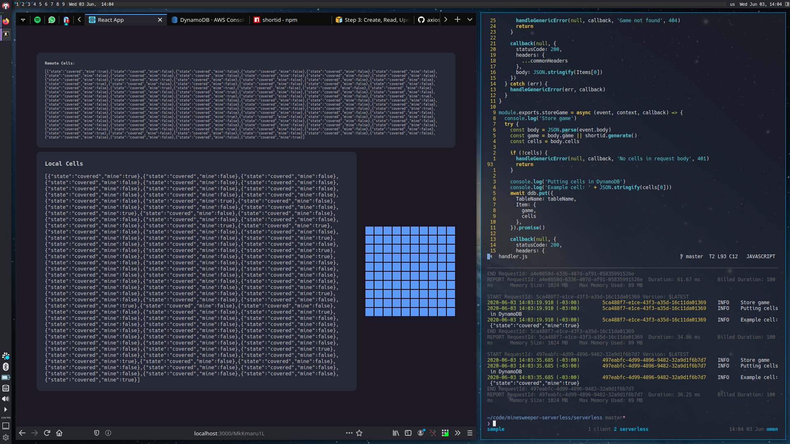

# Minesweeper Serverless + React Demo (WIP)

Minesweeper it's a simple game, you can see my draft for [rules](rules.md) or [this](https://en.wikipedia.org/wiki/Minesweeper_(video_game))
Wikipedia article for the full story.

I decided to use Serverless with AWS Lambda and DynamoDB to store the state,
and React for the application front-end.

Currently in development.
