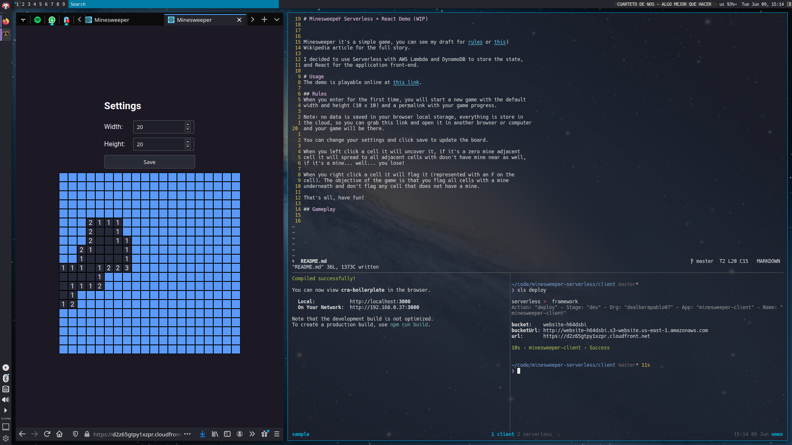
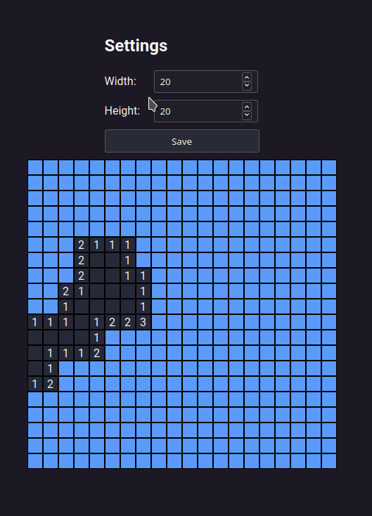

# Minesweeper Serverless + React Demo

Minesweeper it's a simple game, you can see my draft for [rules](rules.md) or [this](https://en.wikipedia.org/wiki/Minesweeper_(video_game))
Wikipedia article for the full story.

It uses Serverless with AWS Lambda and DynamoDB to store the state, and React
for the application front-end hosted in an S3 bucket and CloudFront.

# Usage
The demo is playable online at [this link](https://d2z65gtpy1xzpr.cloudfront.net).

## Rules
When you enter for the first time, you will start a new game with the default
width and height (10 x 10) and a permalink with your game progress.

Note: no data is saved in your browser local storage, everything is stored in
the cloud, so you can grab this link and open it in another browser or computer
and your game will be there.

You can change your settings and click save to update the board.

When you left click a cell it will uncover it, if it's a zero mine adjacent
cell it will spread to all adjacent cells with no mine near as well,
if it's a mine... well... you lose!

When you right click a cell it will flag it (represented with an F on the
cell). The objective of the game is that you flag all cells with a mine
underneath and don't flag any cell that does not have a mine.

That's all, have fun!

## Gameplay

  

